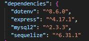
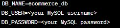
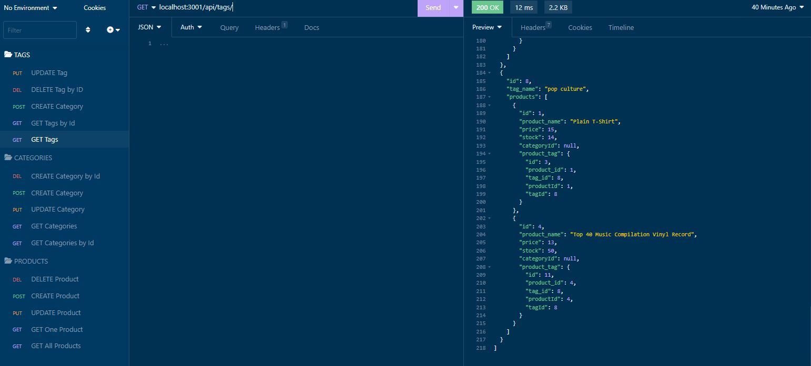
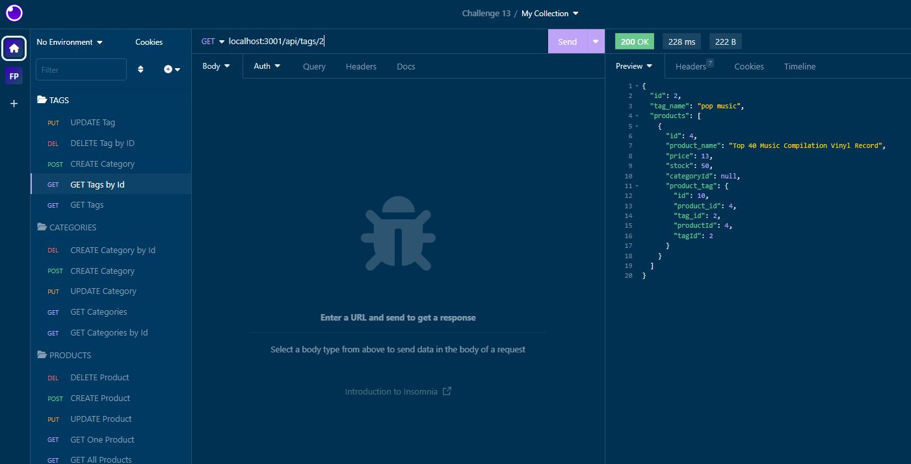
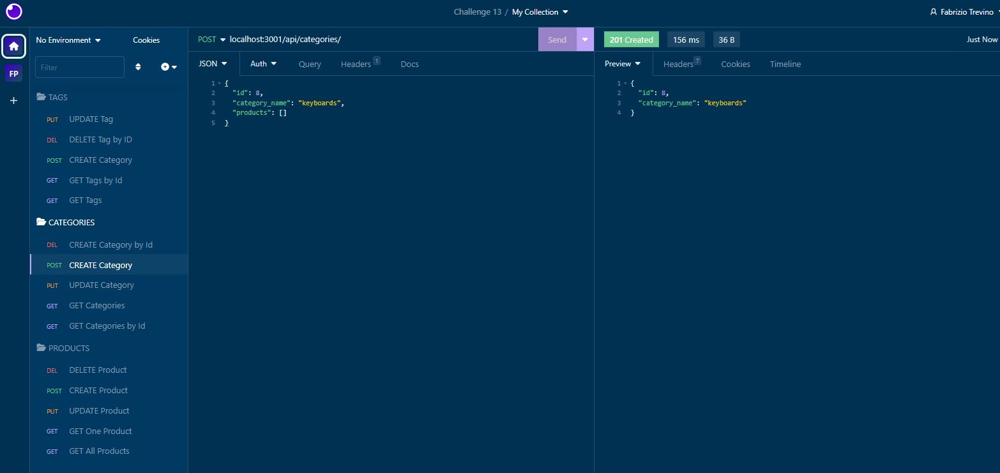
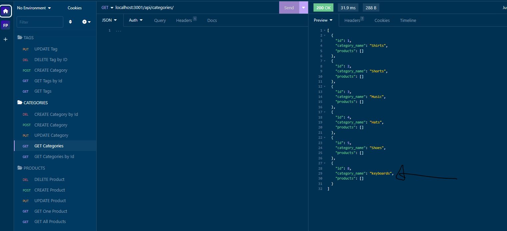
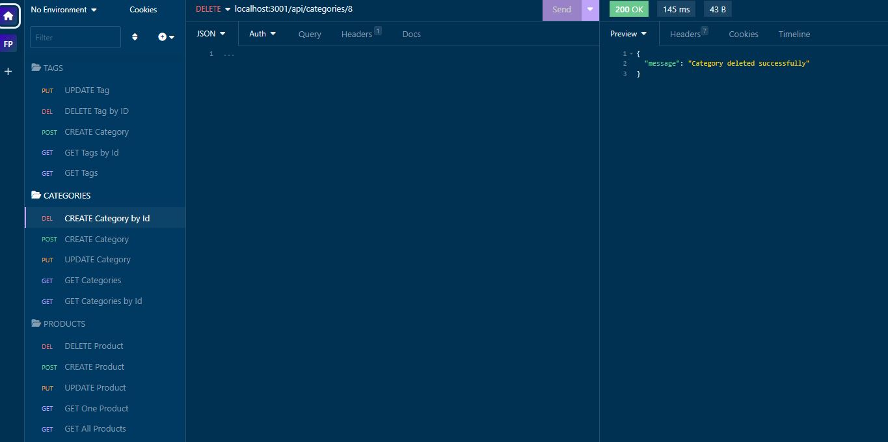

# Fabrizio Treviño E-commerce Back-End

This project is a back end for an e-commerce website built using Express.js and Sequelize. It provides API routes for managing categories, products, and tags, and interacts with a MySQL database.

In order to use this application, you will need to set up your MySQL database and provide the necessary configuration. You will also need to install the following dependencies.

## Configuration

The application requires certain configuration settings to connect to the database. Follow these steps to provide the necessary configuration:

Create a new file named .env in the root directory of the project.
Open the .env file and add the following lines:

Replace your MySQL username and your MySQL password with your actual MySQL credentials.

## Technology Used

The following technologies and packages were used in the development of this application:

- Express.js
- Sequelize
- MySQL2
- dotenv
- Insominia

## Insominia uses

These are all the examples on the uses of Insomnia

- Get

- Get by ID

- Post

- New Item

- Deleted Item

## Walkthrough Video

Please watch the following walkthrough video for a demonstration of the application's functionality: [link to video](https://drive.google.com/file/d/1_dd2y4iLygKIdL5Ak8gUJjfAxTuMf_DX/view)

## Repository

[My Repositories](https://github.com/Fabri-Tech?tab=repositories)

[Assigment Repository](https://github.com/Fabri-Tech/Fabrizio-Trevino-ORM-ECommerce)
